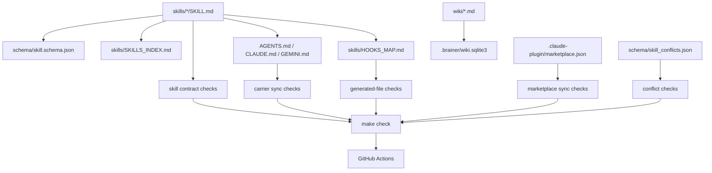

# Brainer

A skill catalog for AI coding agents — Claude Code, Codex, Gemini CLI, GitHub Copilot — across four pillars:

1. **Token-use optimization** — tighter output/input per call.
2. **Context-window optimization & management** — re-reads, compaction survival, routing, retrieval.
3. **LLM wiki-memory framework** — durable repo-local memory: gated writes, progressive retrieval, decay, code-grounded reconcile.
4. **Self-improvement & learning** — compounding what each session learns; drift mitigation; measurement infra.

**Skills, not a framework.** Drop the catalog into any [agentskills.io](https://agentskills.io)-compatible host. Each skill is a single folder with a `SKILL.md`, optional bundled tools, and measured evaluation numbers.

## No-drift promise

Brainer's operating rule is:

> Edit the source of truth, then run `make check`.

`skills/` is the canonical skill body catalog. Host carriers, hook maps, marketplace metadata, generated resident catalogs, wiki indexes, and local audit outputs are either derived from that source or checked against it. A future agent should not need to remember the rules from a chat transcript; the repo should fail loudly when the surfaces disagree.

## Quickstart

```bash
python3 -m pip install pytest
make check
make check-tail
./install.sh --dry-run
```

`make check` is the canonical fast local health gate. It runs skill lint, carrier sync, marketplace sync, skill contract checks, conflict checks, drift-probe schema checks, generated-file policy checks, wiki hygiene, deterministic pytest tests, and the core offline runner in non-writing check mode.

`make check-tail` runs the slower hook/replay tail. `make full-check` is equivalent to `make check` plus `make check-tail`, but some local wrappers cap a single command before both phases can finish.

## Source-of-Truth Model



Operational docs:

- [`docs/GENERATED_FILES.md`](docs/GENERATED_FILES.md) defines canonical, generated, synchronized, and local runtime surfaces.
- [`docs/ADDING_A_SKILL.md`](docs/ADDING_A_SKILL.md) is the checklist for adding or changing a skill without drift.
- [`docs/INSTALL_SAFETY.md`](docs/INSTALL_SAFETY.md) explains installer effects, dry-run behavior, and restore posture.
- [`docs/MEMORY_MODEL.md`](docs/MEMORY_MODEL.md) separates canonical wiki memory from derived indexes and scratch output.

## Most-recommended stack

If you only install one combination, install this. Each item earns its slot with measured numbers — see [`eval/FINDINGS.md`](eval/FINDINGS.md) for the full breakdown.

| Slot | Skill | Why it's in the stack |
|---|---|---|
| Output style | [`caveman-ultra`](skills/caveman-ultra/SKILL.md) + [`lean-execution`](skills/lean-execution/SKILL.md) | **−87.7%** output on verbose-prone prompts (measured combo, [eval/results/caveman+lean.json](eval/results/caveman+lean.json)) |
| Routing | [`prompt-triage`](skills/prompt-triage/SKILL.md) | −20.9% total tokens, 100% classification accuracy on mixed prompts |
| Memory across compaction | [`context-keeper`](skills/context-keeper/SKILL.md) | 97.7% transcript compression, 100% URL recall, hook-driven (zero per-prompt cost) |
| Retrieval (*what / how / connected*) | [graphify](https://github.com/safishamsi/graphify) (`graphify-out/graph.json`, external) | **−93% tokens** vs grep+read at parity evidence using `graphify explain` ([eval/results/graphify_retrieval.json](eval/results/graphify_retrieval.json)) |
| Retrieval (*why / decision*) | [`wiki-memory`](skills/wiki-memory/SKILL.md) | 100% evidence on project-history questions; combo with graphify hits 100% evidence at **−87% vs grep** ([eval/results/graphify_combo.json](eval/results/graphify_combo.json)) |
| Re-reads | [`semantic-diff`](skills/semantic-diff/SKILL.md) | 95.5% reduction on unchanged re-reads (slim Bash CLI, every host; optional MCP `read_file_smart`) |
| Terminal output | [`output-filter`](skills/output-filter/SKILL.md) | −88.8% bytes on noisy logs, all error lines preserved |
| Claims of done | [`verify-before-completion`](skills/verify-before-completion/SKILL.md) | −33.5% output on "is this fixed?" prompts; fires only on done-claims |

These compose **across axes** (output × routing × memory × retrieval × re-read). Per [`eval/FINDINGS.md`](eval/FINDINGS.md), within-axis stacking diminishes (two output-reducers don't sum) — across-axis stacking compounds. The full eight-slot stack has not yet been measured end-to-end as a single number; per-axis wins are independent and additive on their own dimension.

Bootstrap once per project:

```bash
# wiki-memory needs a wiki/ tree:
python3 ~/.local/share/brainer/skills/wiki-memory/tools/wiki.py init
# graphify owns the code graph (auto-installed by ./install.sh; build per repo):
graphify extract .
```

`./install.sh` installs `graphify` from our maintained fork ([SaarShai/graphify@token-economy-patches](https://github.com/SaarShai/graphify/tree/token-economy-patches)) — published `graphifyy` 0.8.17 ships four bugs that affect our skill flow (see [skills/index-first/EVAL.md](skills/index-first/EVAL.md) for the bug list and impact). The installer prefers `pipx` and falls back to `python3 -m pip install --user`. Opt out with `./install.sh --no-graphify` (the wiki-memory and index-first skills degrade gracefully when the graph isn't present). After bootstrap the stack is on automatically — hooks fire per event, descriptions trigger on prompt shape.

## The catalog (27 skills)

**All 27 are symlinked and listed by `./install.sh` (as of v1.13; `loop-engineering`, `eval-gate`, `requirements-ledger`, `brainer-audit`, and `learn-skill` are in the catalog).** `compliance-canary` (the single drift watcher — it absorbed `skill-pulse` at v1.10) auto-wires its `UserPromptSubmit` hook (`auto-install: true`, **default-on since v1.7**); `think` is slash-only (`/think`, no hook). To disable a default-on hook, remove its entry from `.claude/settings.json` by hand.

| Skill | Trigger | Desc tokens | Notes |
|---|---|---:|---|
| [caveman-ultra](skills/caveman-ultra/SKILL.md) | session-start, "be terse" | 68 | Terse output style. ~65% output reduction reported (juliusbrussee/caveman lineage). |
| [plan-first-execute](skills/plan-first-execute/SKILL.md) | task > 3 steps | 50 | Plan-mode gate. |
| [think](skills/think/SKILL.md) | `/think` (manual; slash-only) | 81 | How an agent should think: first-principles, reduce/simplify, research-and-borrow, experiment-to-falsify, no flattery; ideation + 5-whys + pre-mortem/inversion. Frontier A/B: posture **neutral for Opus** (+0.07) but **load-bearing for weak models** (7b failed the traps); restructured Always/When-relevant; slash-only `/think`. See [EVAL](skills/think/EVAL.md). |
| [lean-execution](skills/lean-execution/SKILL.md) | "simplify / lean / prune" | 51 | Pruning rule. |
| [verify-before-completion](skills/verify-before-completion/SKILL.md) | before any "done" claim | 34 | Evidence-first. |
| [wiki-memory](skills/wiki-memory/SKILL.md) | retrieve OR write durable | 90 | Tier-aware (L0–L4) repo-local markdown wiki. |
| [prompt-triage](skills/prompt-triage/SKILL.md) | UserPromptSubmit hook | 69 | Pre-model regex+Ollama classifier; routes simple tasks to cheap models. |
| [context-keeper](skills/context-keeper/SKILL.md) | PreCompact hook | 55 | Structured memory before compaction. |
| [semantic-diff](skills/semantic-diff/SKILL.md) | file re-read | 80 | AST-node diff. 95.5% measured savings on argparse.py re-reads. |
| [index-first](skills/index-first/SKILL.md) | "where is X used / what calls Y" | 81 | Prefer pre-built indexes / composite verbs over grep+read chains. Eval pending. (colbymchenry/codegraph lineage.) |
| [output-filter](skills/output-filter/SKILL.md) | terminal output hook | 70 | Strip ANSI/progress/dup noise; preserves errors. |
| [compliance-canary](skills/compliance-canary/SKILL.md) | UserPromptSubmit hook | 74 | **Default-on since v1.7** (`auto-install: true`). The single drift watcher: a periodic skill-rule re-anchor every N turns (paper-calibrated, arXiv 2510.07777) **plus** symptomatic per-skill `drift_probes.json` scans; the re-anchor yields to a fired probe (no double-nag). Absorbed `skill-pulse` at v1.10. |
| [write-gate](skills/write-gate/SKILL.md) | before any persistent write | 72 | Content-quality gate on durable memory. Signal-score (ogham lineage) + why-clause enforcement (codenamev lineage). Prevents reasonless decisions and recap-style writes. |
| [wiki-refresh](skills/wiki-refresh/SKILL.md) | "refresh wiki / audit vs code" | 76 | Code-grounded reconcile of wiki pages (Keep/Update/Consolidate/Replace/Delete) via `audit-refs`; emits typed `contradicts:` edges. Ground-truth reconcile. |
| [cache-lint](skills/cache-lint/SKILL.md) | before merging hooks/skills, CI | 71 | Static audit against Anthropic's 6 prompt-cache rules (ussumant lineage). FAIL on dynamic content above breakpoint, prefix mutation by Stop-hooks, etc. |
| [task-retrospective](skills/task-retrospective/SKILL.md) | explicit task audit / `/retro` / after-the-fact reconstruction | 105 | User-triggered task audit mode for repeatable project work. Arm it before the task when possible, or reconstruct after the fact; it produces a project-learning report and routes at most 3 durable lessons to project memory, SOPs, checklists, project-specific skills, or broad repo instructions through write-gate. It does not audit Brainer skill obedience or edit canonical Brainer skills. Default-installed. |
| [brainer-audit](skills/brainer-audit/SKILL.md) | explicit Brainer/session audit | 67 | Report-only Brainer skill-use audit mode over normalized events. Detects missed skill triggers, unverified completion claims, output-filter opportunities, dropped requirements, write-gate bypasses, and task-retrospective boundary violations. Claude/Codex hooks are opt-in and marker-gated; Antigravity uses lower-fidelity sidecar snapshots. |
| [loop-engineering](skills/loop-engineering/SKILL.md) | before building a loop / fleet / verifier pipeline | 96 | Use BEFORE building any multi-step agentic loop, generator→verifier pipeline, fan-out/fleet, or iterate-until-correct/retry loop. Picks the loop shape (open/closed · inner/outer · single/fleet), pairs a generator with a SEPARATE verifier, and forces a concrete gate + stop + budget cap up front. Ships loop_lint.py to refuse no-gate / self-grading / unbounded specs. Override with ONE SHOT. **Default-installed** (v1.11). |
| [eval-gate](skills/eval-gate/SKILL.md) | "is this good enough / score this" | 117 | Score AI output against a written rubric before it ships — an LLM-as-judge quality gate for content output (drafts, posts, answers) and product output (an agent's reply, an extraction, a generated payload). Use when asked "is this good enough", "score/grade this", "would this pass", to gate output on quality, to regression-check a prompt/model/pipeline change, or to turn a flagged bad output into a permanent test case. Returns 0-5 + reason; exit code gates. **Default-installed** (v1.11; N≥50 validation pending). |

**Always-resident context tax (resident sentinel block, all skill descriptions): ~7,990 bytes.** Roughly 0.9% of a 200K context window (byte-for-byte proxy; the `marketplace.json` `context_cost_estimate_tokens` figure predates the current catalog and needs remeasuring). Every skill's description is resident; hook scripts and `tools/` load only when fired, adding no resident tax.

Full body cost (worst case, all loaded at once): ~36,200 tokens. In practice, only the triggered skill's body loads.

See [eval/results/static_cost.json](eval/results/static_cost.json) for the full measurement.

**Tuning your install:** stacking guidance, anti-patterns, and workload-aware install advice live in [`eval/FINDINGS.md`](eval/FINDINGS.md) — read once when you adopt the catalog or change which skills are enabled.

**Where these ideas came from:** [`INSPIRATION.md`](INSPIRATION.md) indexes the repos and writeups that shaped this catalog or live in adjacent territory (codegraph, caveman, mattpocock/skills, karpathy's LLM-wiki, cognee, memento, claude-context, …).

### Removed after measurement

**v1.1.0** (no measurable gain or redundant):
- `personal-assistant` — redundant with `prompt-triage` (auto > manual `/pa`).
- `memory-api` — thin MCP wrapper over wiki-memory; same value via CLI.
- `skill-creator` — maintainer tool (not an end-user efficiency skill). Linter and overlap detector live at `scripts/lint_skill_md.py` and `scripts/skill_overlap.py`.

**v1.2.0** (zero measured win after dedicated attempts):
- `delegate` — orchestration contract with no per-call gain; `prompt-triage` already automates the cheap-model routing it advised manually. Subagent lifecycle prose folded into `prompts/` if needed for downstream use.

**v1.3.0** (merged, not dropped):
- `context-refresh` — merged into `handoff` (which was itself later removed; see v1.6.1). Its only unique piece was the auto-launcher (`context.py relay --execute`), which never worked reliably.

**v1.6.0** (the unproven-gain tail + dead weight):
- `handoff-from` + `memory-decay` (redundant / verified no-op), and `compress-context` + `session-recall` + `loop-breaker` (each ❌/🟡 on measured gain and redundant with a kept skill). See [`eval/FINDINGS.md`](eval/FINDINGS.md) "Catalog cuts".

**v1.6.1** (covered by the host):
- `handoff` — operational-only session-handoff command, no measured token/quality gain. The host's `/compact` + the `context-keeper` PreCompact hook now cover session continuity; durable facts still route through `wiki-memory` + `write-gate`.

## Install

**Pick your row.** Claude Code has a real plugin format; the other hosts don't (skills are bare files there). One canonical source (`skills/`), one plugin (`.claude-plugin/marketplace.json`), one installer (`install.sh`) for the rest.

If an agent is given only this repository link and must install or update
Brainer in another project, give it [`AGENT_INSTALL.md`](AGENT_INSTALL.md). That
file is the authoritative, copy-pasteable clone/update/install/verify procedure.

| You use… | Want skills… | Run this |
|---|---|---|
| **Claude Code** | **everywhere** (recommended) | `git clone https://github.com/SaarShai/Brainer.git ~/.local/share/brainer && claude plugin install ~/.local/share/brainer/.claude-plugin/marketplace.json` |
| Claude Code | in one project only | clone into `<project>/.brainer`, then `mkdir -p .claude/skills && ln -sfn ../.brainer/skills/* .claude/skills/` |
| Codex / Gemini CLI | per-project (no plugin format exists for these) | clone into `<project>/.brainer`, then `.brainer/install.sh --host <codex|gemini>` + symlink — see [Per-project install](#per-project-install-non-claude-code-hosts) |
| Copilot / VS Code | per-project | use the root `AGENTS.md` shim from the Brainer checkout; there is no `install.sh --host copilot` flag |
| any supported host (inside the brainer clone itself, e.g. contributing) | for that clone only | `./install.sh` (all supported hosts) or `./install.sh --host <claude-code|codex|gemini>` |

The plugin (`brainer` v1.13.0) bundles all 27 skills. Its manifest declares the default-on `compliance-canary` hook plus optional `prompt-triage` and `context-keeper` hooks.

### Host install matrix

| Host | Plugin? | Where skills land | Extra wiring |
|---|---|---|---|
| Claude Code | **Yes** (`.claude-plugin/marketplace.json`) | `.claude/skills/` or the plugin registry | optional hooks declared in the plugin manifest |
| Codex | No | `.codex/skills/<name>/` | none — SKILL.md auto-discovered |
| Gemini CLI | No | `.gemini/skills/<name>/` | `.gemini/settings.json` extension entry (set by `install.sh`) |
| Copilot / VS Code | No | root `AGENTS.md` shim | auto-discovered by VS Code Copilot |

Plugin packaging is Claude-Code-specific. Other hosts read SKILL.md files directly — there's nothing for them to "plug into," so a Codex/Gemini plugin would be a no-op wrapper. Pattern for the fan-out installer is lifted from `amtiYo/agents`.

### `install.sh` flags

```bash
./install.sh                            # all detected hosts
./install.sh --host claude-code         # one host
./install.sh --host claude-code,codex   # comma-separated subset
./install.sh --dry-run                  # show what would happen
SKILLS_DIR=skills.new ./install.sh      # alternate canonical dir
```

`install.sh` always targets *its own repo*'s hidden dirs (`.claude/skills/`, `.codex/skills/`, etc., next to `install.sh` itself — **not** next to the project you're working in). For per-project install on non-Claude-Code hosts, see below.

### Per-project install (non-Claude-Code hosts)

```bash
cd /path/to/project-X
git clone https://github.com/SaarShai/Brainer.git .brainer
.brainer/install.sh --project "$PWD" --host codex --no-graphify
```

Repeat with `--host gemini` as needed. For the complete agent-facing update
procedure, including dirty-checks and verification, see
[`AGENT_INSTALL.md`](AGENT_INSTALL.md). For Claude Code, use the plugin command
in the table above when you want a user-wide install; use `--project` when the
skills should be scoped to one consumer project.

### Bootstrap wiki-memory in a fresh project

The `wiki-memory` skill needs a `wiki/` tree in your project root. After installing the catalog, run once per project:

```bash
python3 ~/.local/share/brainer/skills/wiki-memory/tools/wiki.py init
# (or .brainer/skills/wiki-memory/tools/wiki.py init for per-project installs)
```

Creates `wiki/{L0_rules.md, L1_index.md, schema.md, L2_facts/, L3_sops/, L4_archive/, raw/, concepts/, patterns/, projects/, people/, queries/, templates/}` seeded from the skill's bundled defaults. Idempotent — safe to re-run. Default target is `./wiki` in cwd; override with `--root <path>` or `WIKI_ROOT=<path>`. Without this step, `wiki-memory` triggers correctly but has nothing to retrieve.

### Updating an existing install (and removing cut skills)

The catalog evolves — skills get added, and some get **cut** after measurement (see the changelog above). To bring a project that already has an older set up to date:

- **Claude Code (plugin):** the plugin manifest (`.claude-plugin/marketplace.json`) is the source of truth. Update the plugin and Claude Code syncs the skill list **and** hooks to the current catalog — cut skills disappear, new ones appear, no manual cleanup.
- **Symlink hosts (Codex / Gemini) or a manual install:**

  ```bash
  cd .brainer && git pull        # pull the latest catalog
  ./install.sh                          # re-wire — self-healing (--dry-run to preview)
  ```

  A re-run is **self-healing**: it (re)symlinks the current skills, **prunes broken symlinks** for any cut skill, **prunes dead hooks** from `.claude/settings.json` whose script no longer exists, and regenerates the resident catalog (`CLAUDE.md` / `AGENTS.md` / `GEMINI.md`). New skills install on the same pass.

The one thing it deliberately *won't* do is disable a **default-on** hook (`compliance-canary`, `auto-install: true` since v1.7) — its script still exists, so the prune leaves it wired; to turn it off, drop its hook entry from `.claude/settings.json` by hand (or `COMPLIANCE_CANARY_DISABLED=1`).

## What changed (vs the old framework)

This used to be framed as a framework with a `te` CLI, layered docs (`start.md`, `L0_rules.md`, `L1_index.md`, `brainer.yaml`), and project-style research under `projects/`. All of that is gone.

- `te` CLI → deleted. Each skill owns its scripts in `skills/<name>/tools/`.
- `start.md`, `L0_rules.md`, `L1_index.md`, `brainer.yaml`, `models.yaml` → deleted. Replaced by `skills/SKILLS_INDEX.md`.
- `adapters/`, `prompts/`, `hooks/` → deleted. Folded into per-skill `tools/`.
- 11 old skills → audited, expanded, trimmed after measurement, and then rebuilt into the current **19-skill** catalog.
- Working Python projects (ComCom, semdiff, context-keeper, agents-triage, output-filter) → bundled into their matching skills' `tools/` folders.
- Wiki content (`raw/`, `concepts/`, `patterns/`, `projects/`, `people/`, `queries/`, `L2_facts/`, `L3_sops/`, `L4_archive/`, `index.md`, `log.md`, `schema.md`, `templates/`) → moved under `wiki/`. The `wiki-memory` skill reads it.
- `bench/` → kept at root for eval datasets.
- 8 stale agent worktrees → cleaned via `git worktree remove`.

Result: ~50 framework files removed; the catalog is 800K of skill folders plus a small installer.

## Measurement

The repo ships a measurement harness at `eval/`:

```bash
python3 eval/static_cost.py                              # static description/body/tools cost
python3 eval/runner.py --task eval/tasks/<skill>.yaml    # A/B per skill (needs Ollama or Anthropic API)
python3 eval/judge.py eval/results/<skill>.json          # LLM-as-judge quality scoring
```

Per-skill `EVAL.md` files carry static numbers today; live A/B numbers fill in once a backend is wired. See [eval/README.md](eval/README.md) for the full methodology including Kaggle T4 batching and Xiaomi MiMo judging via HuggingFace Inference.

## Lineage

Built on prior work:

- [agentskills.io](https://agentskills.io) — open standard, 35+ hosts.
- [anthropics/skills](https://github.com/anthropics/skills) — canonical SKILL.md and `skill-creator` patterns.
- [amtiYo/agents](https://github.com/amtiYo/agents) — canonical-source-of-truth + symlink-fanout pattern.
- [shinpr/sub-agents-skills](https://github.com/shinpr/sub-agents-skills) — `run-agent: codex|claude|cursor-agent|gemini` cross-LLM dispatch (quoted verbatim from that repo's flag syntax).
- [muratcankoylan/Agent-Skills-for-Context-Engineering](https://github.com/muratcankoylan/Agent-Skills-for-Context-Engineering) — 15-skill catalog precedent.
- [coleam00/claude-memory-compiler](https://github.com/coleam00/claude-memory-compiler) — SessionEnd → wiki distillation.
- [cocoindex-io/cocoindex-code](https://github.com/cocoindex-io/cocoindex-code) — AST MCP code search.
- [lm-sys/RouteLLM](https://github.com/lm-sys/RouteLLM) — model routing reference for `prompt-triage`.

## Status

- 27 skills written and lint-clean.
- 3 hosts wired and verified (Claude Code, Codex, Gemini CLI).
- Static-cost measurements published.
- Live A/B harness ready; needs a healthy Ollama / explicit `ANTHROPIC_API_KEY` / `HF_TOKEN` to run.

Author: Saar Shai. MIT.
